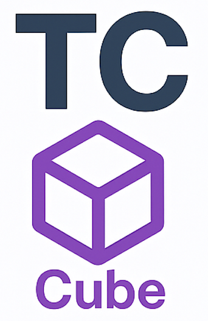

# TestCube

**TestCube** is the expandable, cable-free fixture and plugin platform of the TC-Platform.  
Its goal is to enable simple, fast, and reliable connection and testing of various devices under test (DUTs), even in standalone operation.

---

## Key Features

- **Modular, cable-free fixture** (cube or other geometry with connectorized sides)
- **Plugin modules** (e.g., Raspberry Pi, custom or 3rd party extensions)
- **Standalone operation** (built-in controller, integrated instruments, only power and network required)
- **LAN and/or WiFi connectivity** (e.g., via RPi)
- **Centralized data collection to InfluxDB**
- **Client-server architecture support**
- **Open source mechanical and electronic documentation**

---

## Documentation

- [TC-Platform main repo](https://github.com/Horikari/TC-Platform) – ecosystem, architecture, branding, integrations
- [TestComposer](https://github.com/Horikari/TestComposer) – software control, sequencing, GUI
- [TestCombiner](https://github.com/Horikari/TestCombiner) – modular instrument hardware

---

## Contributing

Ideas, bug reports, pull requests, and forks are **welcome from everyone!**

---

## License

This project is licensed under the MIT License.  
See: [LICENSE](LICENSE)

---

© 2025 Horikari
